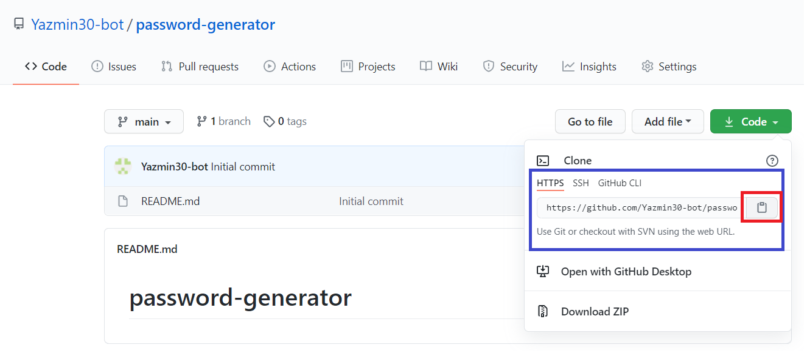
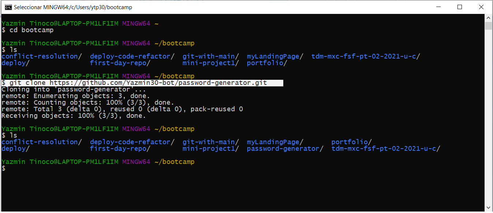

# <Password Generator>
## Description
This app will run in the browser and will feature dynamically updated HTML and CSS powered by JavaScript code that you write. It have a clean and polished, responsive user interface that adapts to multiple screen sizes.

## Requirements
This proyect  requires no modules outside of the core.

## Installation
* Go to the following link [https://github.com/Yazmin30-bot/password-generator/](https://github.com/Yazmin30-bot/password-generator/) and clone the link 

* Go to Git-bash and page the github's with the following code `$ git clone https://github.com/Yazmin30-bot/password-generator.git ` 

## Links
* The URL of the deployed application.
[https://yazmin30-bot.github.io/password-generator/](https://yazmin30-bot.github.io/password-generator/)

* The URL of the GitHub repository
[https://github.com/Yazmin30-bot/password-generator/](https://github.com/Yazmin30-bot/password-generator/)